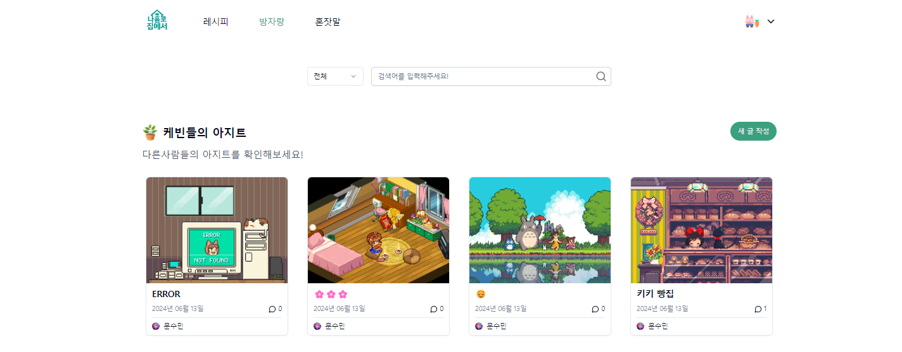

## 나홀로집에 프로젝트 [BackEnd]
"나홀로집에"는 세상의 모든 케빈들이 외롭지 않도록, 1인 가구들을 위한 소통의 장입니다.
  
혼자만의 생활을 더 풍요롭게 만들고 싶다면 우리 커뮤니티를 이용하여 일상을 나눠보세요!

 
<a href ="http://34.22.76.244/">
    

      
    

</a>

클릭하여 사이트로 이동
  

개발기간: 2024.05.15~2024.06.15 (약 1달)

## 👨‍👩‍👧‍👦 멤버 구성
### BackEnd
- 팀장 안수민 : 중고거래게시판(usedtrade), AWS 서버 배포
- 팀원 유기원 : 레시피게시판(recipe), 댓글(comment) VM/Docker 서버 배포
- 팀원 장성규 : 채팅기능(chatting), Socket IO
- 팀원 홍유나 : 방자랑,혼잣말 게시판(room/talk)
- 팀원 권예지 : 회원관리(member/Auth), JWT, Redis, OAuth 2.0
- 팀원 고민성 : 북마크, 스크랩(book/scrap)
- 팀원 노석규 : 청년지원게시판(support)

## ⚙️개발환경
- Language : Java 17 
- Framework: Spring Boot
- Database : Mysql, H2
- No-SQL : Redis, MongoDB
- Security : Spring Security, JWT, OAuth 2.0 
- Query Language: SQL, QueryDSL 
- Build Tool: Gradle 
- Testing: JUnit 
- Data Access: Spring Data JPA, Spring Data JDBC 
- Code Simplification: Lombok 
- 배포 : AWS, VM