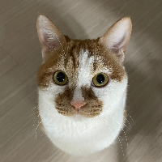

## 나홀로집에 프로젝트 [BackEnd]
"나홀로집에"는 세상의 모든 케빈들이 외롭지 않도록 1인 가구를 위한 소통의 장입니다.
  
혼자만의 생활을 더 풍요롭게 만들고 싶다면 우리 커뮤니티를 이용하여 일상을 나눠보세요!

 
<a href ="http://34.22.76.244/">
    

      
    

</a>

In progress 2024.05.15~2024.06.15   

## 멤버 구성
<table style="width: 100%;">
  <tr>
    <td style="width: 14%; text-align: center;"></td>
    <td style="width: 14%; text-align: center;"></td>
    <td style="width: 14%; text-align: center;"></td>
    <td style="width: 14%; text-align: center;"></td>
    <td style="width: 14%; text-align: center;"></td>
    <td style="width: 14%; text-align: center;"></td>
    <td style="width: 14%; text-align: center;"></td>
  </tr>
  <tr>
    <td style="width: 14%; text-align: center;"><a href=""><strong>BE 팀장 안수민</strong></a></td>
    <td style="width: 14%; text-align: center;"><a href=""><strong>BE 팀원 유기원</strong></a></td>
    <td style="width: 14%; text-align: center;"><a href="https://github.com/mylazysundaycat"><strong>BE 팀원 권예지</strong></a></td>
    <td style="width: 14%; text-align: center;"><a href=""><strong>BE 팀원 장성규</strong></a></td>
    <td style="width: 14%; text-align: center;"><a href=""><strong>BE 팀원 홍유나</strong></a></td>
    <td style="width: 14%; text-align: center;"><a href=""><strong>BE 팀원 고민성</strong></a></td>
    <td style="width: 14%; text-align: center;"><a href=""><strong>BE 팀원 노석규</strong></a></td>
  </tr>
</table>

✔️팀장 안수민
- 중고 거래 게시판 구현
- Java 및 Springboot를 활용한 Backend REST API 서버 구현
- 레시피 데이터 크롤링
- 프로젝트 발표 및 문서화

✔️유기원
- 레시피 게시판, 댓글 기능 구현
- Java 및 Springboot를 활용한 Backend REST API 서버 구현
- QueryDSL 을 통한 데이터 관리
- VM, Docker를 이용한 프로젝트 빌드 및 배포
- Jenkins를 활용한 CI/CD 파이프라인 구축

✔️권예지
- 회원 기능 구현
- Java 및 Springboot를 활용한 Backend REST API 서버 구현
- Spring Security를 활용한 JWT 기능 구현
- OAuth 2.0을 활용한 소셜 로그인(네이버, 카카오) 구현
- Redis, Cookie를 통한 유저 상태 관리 구현

✔️장성규
- 실시간 채팅 기능 구현
- Java 및 Springboot를 활용한 Backend REST API 서버 구현
- 채팅 기능 구현을 위한 Socket IO 구축

✔️홍유나 
- 방자랑, 혼잣말 게시판 구현
- Java 및 Springboot를 활용한 Backend REST API 서버 구현
- 이미지 DB 관리를 위한 Firebase 구축

✔️고민성
- 북마크, 스크랩 기능 구현
- Java 및 Springboot를 활용한 Backend REST API 서버 구현

✔️노석규
- 청년 정책 게시판 구현
- Java 및 Springboot를 활용한 Backend REST API 서버 구현

## 기술스택

✔️Backend 

✔️DB 

✔️CI/CD 

✔️Deployment 

✔️Communication 

